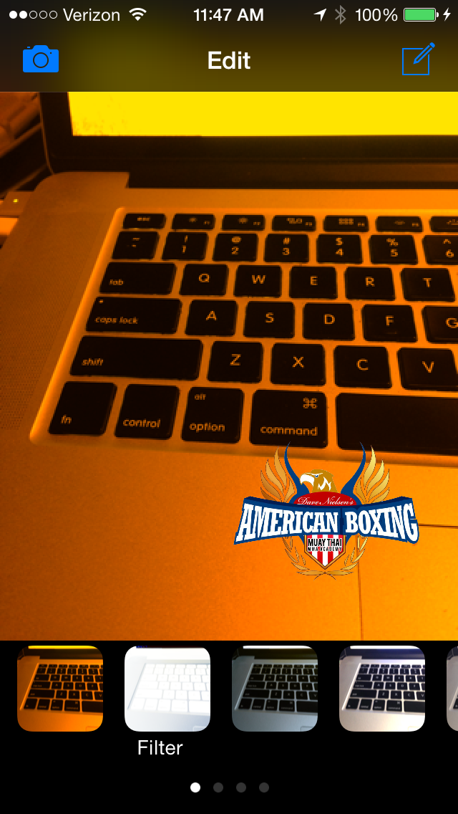

# abphoto (American Boxing Photo App)
iOS Photo Upload App for American Boxing

abphoto is a demonstration app for UI design, photo manipulation, and social app that I did for a boxing gym www.americanboxing.net that I was training in.  It is built to be take some Instagram function with Facebook link to the boxing gym's facebook business page.  This is app is built to demonstrate iOS's photo callbacks, UI designs similar to Instagram, and an photo upload feature with iOS's social API and Facebook's own API.  

##Requirements
* XCode 6 or higher
* iOS 7 or higher
* Apple LLVM compiler
* ARC

## Features
### Photo Taking
Photo with custom overlay and custom shutter botton to take a photo.  
  

### Photo Filtering
A selection of 10 pre-set filters from sepia, vignetting, overexposure and more with effect previews
  
  

### Watermarking
Adding American Boxing Gym's official logo to the photo to the captured and filtered photo.  Rotate, enlarge, add drop shadow, and change the color of the drop shadow.

### Sharing and Facebook publishing 

